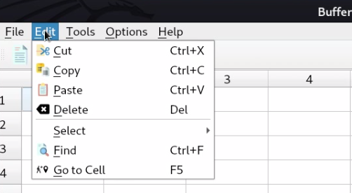
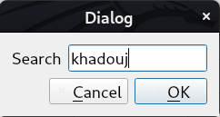
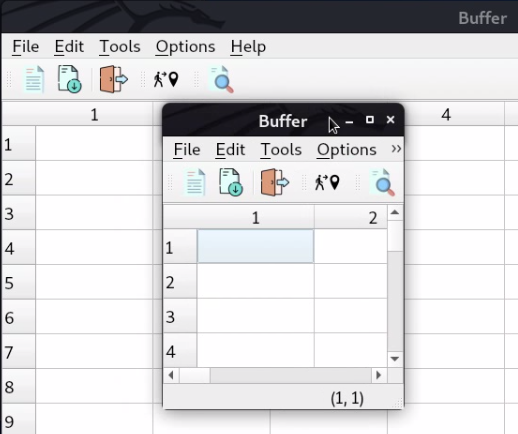
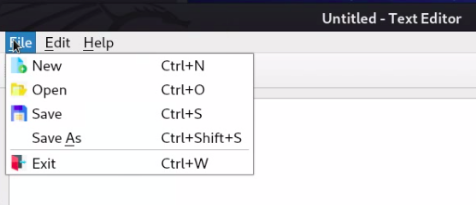
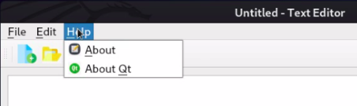
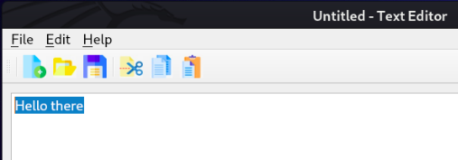

<div id="top"></div>


<!-- PROJECT LOGO -->
<br />
<div align="center">
    
  <h2 align="center">Application Using Main Window</h2>
  <h3 align="center">Create a MainWindow based application using the designer</h3>
</div>


<!-- TABLE OF CONTENTS -->
<summary>Table of Contents</summary>
  <ol>
        <li><a href="#SpreadSheet">SpreadSheet (Functionality)</a></li>
           <ul> 
              <li><a href="#Context">Context</a></li>
                  <ul> 
                    <li><a href="#Remarks">Remarks</a></li>           
                  </ul>
              <li><a href="#Go-Cell">Go Cell</a></li>
              <li><a href="#Find-Dialog">Find Dialog</a></li>
              <li><a href="#Saving-and-loading-files">Saving and loading files</a></li>
                  <ul> 
                    <li><a href="#Saving-Content">Saving Content</a></li>
                    <li><a href="#Save-File-action">Save File action</a></li>
                    <li><a href="#Load-File">Load File</a></li>
                  </ul>
              <li><a href="#other-actions">Other Actions</a></li>
                  <ul> 
                    <li><a href="#Copy">Copy</a></li> 
                    <li><a href="#Cut">Cut</a></li>
                    <li><a href="#Paste">Paste</a></li>
                    <li><a href="#Delete">Delete</a></li> 
                    <li><a href="#Select-rows">Select rows</a></li>
                    <li><a href="#Select-columns">Select columns</a></li>
                    <li><a href="#Show-last-5-recent-files">Show last 5 recent files (after saving)</a></li>
                    <li><a href="#Open-recent-files">Open recent files</a></li>
                    <li><a href="#Open-and-save-csv-files">Open & save csv files</a></li>
                    <li><a href="#About-Qt">About Qt</a></li>
                    <li><a href="#About-spreadsheet">About spreadsheet</a></li>
                    <li><a href="#Save-As">Save As</a></li>
                    <li><a href="#New-file">New file</a></li> 
                  </ul>
            </ul>
              <li><a href="#Text-Editor">Text Editor</a></li>
                  <ul> 
                    <li><a href="#Creating-the-project">Creating the project</a></li> 
                    <li><a href="#Menus">Menus</a></li>
                      <ul>
                         <li><a href="#Actions">Actions</a></li>
                            <ul>
                               <li><a href="#File-Actions">File Actions</a></li>
                               <li><a href="#Edit-Actions">Edit Actions</a></li>
                               <li><a href="#Help-Actions">Help Actions</a></li>
                           </ul>
                      </ul>    
                 </ul>  
    </ol>

<!-- ABOUT THE PROJECT -->
## About The Project

<!-- GETTING STARTED -->
### Getting Started

This is an example of how you may give instructions on setting up your project locally.
To get a local copy up and running follow these simple example steps.

1. [**How to install Qt**](https://anassbelcaid.github.io/CS221/qtcreator/)
2. **Clone the repo**
   ```sh
   git clone https://github.com/IlyasKadi/SpreadSheet.git
   ```

<p align="right">(<a href="#top">back to top</a>)</p>


# SpreadSheet
## Context
In the lecture on **QMainWindow**, we wrote the code for the graphical and set of actions for our main SpreadSeet application. Now we will focus on writing a set of basic functionality.

  In the our last iteration of the SpreadSheet we did obtain an application with:
   * Menu Bar
   * Two tools bars
   * Status bar to print the informations

You should have an application that looks like that :
   
   <p align="center">
     
   </p>  
  
| File                                    | Edit                                | tools                                  |
| :---                                    |             :----:                  |                                  ---: |
|              |          |            |


| options       | help     | 
|  --------     | ----     | 
|   | |
  
<p align="right">(<a href="#top">back to top</a>)</p>

### Remarks

We did add the following modifications:

   1. The `updateStatusBar` now takes two ints in order to syncrhonize with the selected item from the spreadsheet.
  
 ```cpp
  void updateStatusBar(int, int) 
 ```

Here is the **implementation** of this function:

```cpp
   void SpreadSheet::updateStatusBar(int row, int col)
    {
     QString cell{"(%0, %1)"};
     cellLocation->setText(cell.arg(row+1).arg(col+1));
    }
```
Which simply change the **cellLocation** text with the current cell coordinates.

   1. We added the `makeConnexion()` function to connect all the actions. Here is the content of the this function:
    
```cpp
 void SpreadSheet::makeConnexions()
{
    // --------- Connexion for the  select all action ----/
    connect(all, &QAction::triggered,
            spreadsheet, &QTableWidget::selectAll);

    // Connection for the  show grid
    connect(showGrid, &QAction::triggered,
            spreadsheet, &QTableWidget::setShowGrid);

    //Connection for the exit button
    connect(exit, &QAction::triggered, this, &SpreadSheet::close);

    //connectting the chane of any element in the spreadsheet with the update status bar
    connect(spreadsheet, &QTableWidget::cellClicked, this,  &SpreadSheet::updateStatusBar);

    //connnet the gocell action
    connect(goCell, &QAction::triggered, this, &SpreadSheet::goCellSlot);

    //connnet the find action
    connect(find, &QAction::triggered, this, &SpreadSheet::findSlot);

    //connnet the savefile action
    connect(save,&QAction::triggered,this,&SpreadSheet::saveSlot);

    //connnet the saveAsfile action
    connect(saveAs,&QAction::triggered,this,&SpreadSheet::saveasslot);

    //connnet the newfile action
    connect(newFile,&QAction::triggered,this,&SpreadSheet::newfileslot);

    //connect the openfile action
    connect(open,&QAction::triggered,this,&SpreadSheet::loadslot);

    //connect the copy action
    connect(copy,&QAction::triggered,this,&SpreadSheet::copyslot);

    //connect the cut action
    connect(cut,&QAction::triggered,this,&SpreadSheet::cutslot);

    //connect the paste action
    connect(paste,&QAction::triggered,this,&SpreadSheet::pasteslot);

    //connect the delete action
    connect(deleteAction,&QAction::triggered,this,&SpreadSheet::deleteslot);

    //connect the select row
    connect(row,&QAction::triggered,this,&SpreadSheet::selectrowslot);

    //connect the select col
    connect(Column,&QAction::triggered,this,&SpreadSheet::selectrcolslot);

    //connect the about-Qt
    connect(aboutQt,&QAction::triggered,this,&SpreadSheet::aboutqtslot);

    //connect the about
    connect(about,&QAction::triggered,this,&SpreadSheet::aboutslot);
}
 ```

<p align="right">(<a href="#top">back to top</a>)</p>


## Go-Cell

Now we will add the function for the **goCell** action. For that, we need to create a **Dialog** for the user to select a cell.

here are the steps to acomplish that:

   1. Create a Form Class:

   2. Using the designer obtain the following the form:

<p align="center">
  
</p>

 >Ui components of the Go Dialog. 


   3. Add the regular expression validator for the lineEdit:
 ```cpp
 //Validating the regular expression
 QRegExp regCell{"[A-Z][1-9][0-9]{0,2}"};
 //Validating the regular expression
 ui->lineEdit->setValidator(new QRegExpValidator(regCell));
```
   4. Add a public Getter for the line edit Text to get the cell address:
 ```cpp
    QString GoCellDialog::cell() const
    {
        return ui->lineEdit->text();
    }
 ```

No we are setup to create the interesting connexion between the goCell action:

  1. First we will create the proper slot called goCellSlot to respond to the action trigger.
```cpp
   private slots:
   void goCellSlot();            // Go to a Cell slot
```

  2. connect the action to its proper slot in the makeConnexions function:
```cpp
   //Connextion between the gocell action and the gocell slot
   connect(goCell, &QAction::triggered, this, &SpreadSheet::goCellSlot);
```

  3. Now for the fun part. We will implement the goCellSlot() function:
   
```cpp
   void SpreadSheet::goCellSlot()
     {
        //Creating the dialog
        GoCellDialog D;
        //Executing the dialog and storing the user response
        auto reply = D.exec();
       //Checking if the dialog is accepted
       if(reply == GoCellDialog::Accepted)
       {
             //Getting the cell text
             auto cell = D.cell();
             //letter distance
             int row = cell[0].toLatin1() - 'A';
             cell.remove(0,1);
             //second coordinate
             int col =  cell.toInt();
             //changing the current cell
             spreadsheet->setCurrentCell(row, col-1);
         }
     }
```
| Cell location     | Cell avtivated     | 
|  --------  | ----     | 
|   | |

> Go to Cell dialog and response. 

<p align="right">(<a href="#top">back to top</a>)</p>


## Find Dialog
We will move now for the **Find** dialog. This dialog prompts the user for a input and seek a cell that contains the entered text.
  
  1. Create a Form Class with the following ui:
  
<p align="center">
  
</p>

> Find Dialog ui form.  
    
   1. Add a **Getter** to obtain the searched text.
   2. Implements the connexion between the **dialog** and the **find** function:

Here is a set of useful information about the `QTableWidget` class:

   + The method `rowCount()` gives the number of rows.
   + The method `columnCount()` gives the number of columns in the spreadsheet.
   + The Method `item(int i, int j)` return a pointer on the cell indexed by i and j.

   + If this pointer is not null, you could get its content by the method `text()` which returns a `QString`.
   + Finally, the method to change the **focused** cell is
```cpp
   spreadsheet->setCurrentCell(int i, int j);
```

| String to find     | String found     | 
|  --------  | ----     | 
|   | |

> Find Dialog ui form.

<p align="right">(<a href="#top">back to top</a>)</p>

## Saving-and-loading-files

For our final task, we will learn how to save the content of our spreadsheet in a simple format. Since a spreadsheet is not forcefully **tabular**, it will be a waste to save all the **empty** data. Hence, we will choose a simple format that store the **coordinates** and the **content** of the non empty cells.
```cpp
i1, j1, content1
i2, j2, content2
.
.
.
```
<p align="right">(<a href="#top">back to top</a>)</p>

### Saving-Content
We will start by writing a **private** function `saveContent(QSTring filename)` to save the content of our spreadsheet in a text file.

   1. We will add the declaration in the header file:

```cpp
 protected:
     void saveContent(QString filename)const;
```
   2. For the implementation, we will using two classes:

   - QFile which provides an interface to read and write in files.
   - QTextStream for manipulating objects with a stream such as a file.

   3. Here is the complete implementation of this function: 

```cpp
void SpreadSheet::saveContent(QString filename) const
 {

     //Gettign a pointer on the file
     QFile file(filename);

     //Openign the file
     if(file.open(QIODevice::WriteOnly))  //Opening the file in writing mode
     {
         //Initiating a stream using the file
         QTextStream out(&file);

         //loop to save all the content
         for(int i=0; i < spreadsheet->rowCount();i++)
             for(int j=0; j < spreadsheet->columnCount(); j++)
             {
                 auto cell = spreadsheet->item(i, j);

                 //Cecking if the cell is non empty
                 if(cell)
                 out << cell->row() << ", "<< cell->column() << ", " << cell->text() << endl;
             }

     }
     file.close();
 }
```

<p align="right">(<a href="#top">back to top</a>)</p>

### Save-File-action

Now that we have an operational `saveContent` function, we could focus on the slot itself.

So first we will create a **slot** to respond to the action trigger in the header.


```cpp
private slots:
    void saveSlot();             //Slot to save the content of the file

```
Now we will add the connexion in the `makeConnexion` function:
```cpp
   //Connexion for the saveFile
   connect(save, &QAction::triggered, this, &SpreadSheet::saveSlot);
```
Finally for the interesting part, the implementation of the slot

```cpp
void SpreadSheet::saveSlot()
{
    //Creating a file dialog to choose a file graphically
    auto dialog = new QFileDialog(this);

    //Check if the current file has a name or not
    if(currentFile == "")
    {
       currentFile = dialog->getSaveFileName(this,"choose your file");

       //Update the window title with the file name
       setWindowTitle(currentFile);
    }

   //If we have a name simply save the content
   if( currentFile != "")
   {
           saveContent(currentFile);
   }
}
```
<p align="right">(<a href="#top">back to top</a>)</p>


### Load-File
```cpp
void SpreadSheet::loadContent(QString filename)
{

    for(int i=0;i<spreadsheet->rowCount();i++)
    {
        for(int j=0;j<spreadsheet->columnCount();j++)
        {
            auto cell = spreadsheet->item(i,j);
            if(cell)
            {
                cell->setText("");
            }
        }
    }
    QFile file(filename);

    if(file.open(QIODevice::ReadOnly))
    {
        QTextStream in(&file);
        while(!in.atEnd())
        {
            QString line;
            line=in.readLine();
            auto tokens=line.split(QChar(','));
            int row = tokens[0].toInt();
            int col = tokens[1].toInt();
            auto cell = new QTableWidgetItem(tokens[2]);
           spreadsheet->setItem(row,col,cell);
        }
    }
}
```

<p align="right">(<a href="#top">back to top</a>)</p>

## Other-Actions's slots
### Copy
```cpp

void SpreadSheet::copyslot()
{
    auto cell = spreadsheet->item(spreadsheet->currentRow(),spreadsheet>currentColumn());
    QString cellc =cell->text();
    clipboard->setText(cellc);

}
 ```
### Cut
```cpp

void SpreadSheet::cutslot()
{
     auto cell = spreadsheet->item(spreadsheet->currentRow(),spreadsheet->currentColumn());
     QString cellc =cell->text();
     clipboard->setText(cellc);
     cell->setText("");

}
 ```
### Paste
```cpp

void SpreadSheet::pasteslot()
{
   QString text = clipboard->text();
   auto  cell = spreadsheet->item(spreadsheet->currentRow(),spreadsheet->currentColumn());

     if(!cell)
     {
         cell = new QTableWidgetItem((text));
         spreadsheet->setItem(spreadsheet->currentRow(),spreadsheet->currentColumn(),cell);
     }


    cell->setText(text);
}
 ```

### Delete
```cpp
void SpreadSheet::deleteslot()
{
    int selcol = spreadsheet->currentColumn();
    int selrow = spreadsheet->currentRow();
    auto cell = spreadsheet->item(selrow,selcol);
    cell->setText("");
}
 ```
 ### Select-rows
```cpp
void SpreadSheet::selectrowslot()
{
  int row = spreadsheet->currentRow();
    for(int i=0;i<spreadsheet->columnCount();i++)
    {
        auto  cell = spreadsheet->item(row,i);
        cell =new QTableWidgetItem;
        spreadsheet->setItem(row,i,cell);
        cell->setSelected(true);
    }
}
 ```
  ### Select-columns
```cpp
void SpreadSheet::selectrcolslot()
{
  int col = spreadsheet->currentColumn();
    for(int i=0;i<spreadsheet->rowCount();i++)
    {
        auto  cell = spreadsheet->item(i,col);
        cell =new QTableWidgetItem;
        spreadsheet->setItem(i,col,cell);
        cell->setSelected(true);
    }
}
 ```
  ### Show-last-5-recent-files
  ```cpp
void SpreadSheet::saveContent(QString filename)
{
    QFile file(filename);

    if(file.open(QIODevice::WriteOnly))
    {
        QTextStream out(&file);
        for(int i=0;i<spreadsheet->rowCount();i++)
        {
            for(int j=0;j<spreadsheet->columnCount();j++)
            {
                auto cell = spreadsheet->item(i,j);
                if(cell)
                {
                    out  << cell->text() << ",";
                }

            }
             out<< Qt::endl;
        }
    }

    if(files.length()==5)
    {
        files.pop_back();
        files.push_front(new QAction(filename));
        recentfile->clear();
        recentfile->addActions(files);
        for(int i=0; i <files.size(); i++)
            connect(files[i],&QAction::triggered,this,&SpreadSheet::openrecentfilesslot);
    }

     if(files.length()>=0&&files.length()<5)
    {
         int c=0;
        for(int i=0;i<files.length();i++)
        {
            if(filename==files[i]->text())
            {
                c++;
            }


        }
        if(c==0)
        {
            files.push_front(new QAction(filename));

        }

     }
     recentfile->clear();
     recentfile->addActions(files);
     for(int i=0; i <files.size(); i++)
         connect(files[i],&QAction::triggered,this,&SpreadSheet::openrecentfilesslot);


    file.close();

}
 ```
 
 | File       | Edit     | 
|  --------  | ----     | 
|   | |

> The last file is always shown in the top of the 5 recent files (no redundancy, and only max of 5 files)


   ### Open-recent-files
 ```cpp
 void SpreadSheet::openrecentfilesslot()
{
    auto action = dynamic_cast<QAction*>(sender());
    if(action)
    {
        QString path = action->text();
        currentFile=new QString(path);
        loadContent(path);
         setWindowTitle(path);
    }
}
 ```
   ### Open-and-save-csv-files
 ```cpp
void SpreadSheet::loadContent(QString filename)
{

    QFile file(filename);

    if(file.open(QIODevice::ReadOnly))
    {
        QTextStream in(&file);
        int row=0;
        while(!in.atEnd())
        {
            int col=0;
            QString line;
            line=in.readLine();
             auto tokens=line.split(QChar(','));
             for(QString s:tokens)
             {
                 auto cell = new QTableWidgetItem(s);
                 spreadsheet->setItem(row,col,cell);
                 col++;
             }
             row++;
        }
    }
}

void SpreadSheet::saveContent(QString filename)
{
    QFile file(filename);

    if(file.open(QIODevice::WriteOnly))
    {
        QTextStream out(&file);
        for(int i=0;i<spreadsheet->rowCount();i++)
        {
            for(int j=0;j<spreadsheet->columnCount();j++)
            {
                auto cell = spreadsheet->item(i,j);
                if(cell)
                {
                    out  << cell->text() << ",";
                }

            }
             out<< Qt::endl;
        }
    }
 }

 ```
 <p align="center">
  
</p>

 ### About-Qt

```cpp
void SpreadSheet::aboutqtslot()
{
    QMessageBox::aboutQt(this,"about_QT");
}
 ```
 
 <p align="center">
  
</p>

  ### About-spreadsheet

```cpp
void SpreadSheet::aboutslot()
{
    QMessageBox::about(this,"About spreadsheet",abouttext);
}
 ```
 
 <p align="center">
  
</p>

   ### Save-As

```cpp
void SpreadSheet::saveasslot()
{
    if(currentFile)
    {
        QFileDialog D;
        auto filename =D.getSaveFileName();
        currentFile=new QString(filename);
        setWindowTitle(*currentFile);
        saveContent(*currentFile);
    }
}
 ```
   ### New-file

```cpp
void SpreadSheet::newfileslot()
{
    auto newfile = new SpreadSheet;
    newfile->show();
}
 ```
 <p align="center">
  
</p>
 
 
 
<p align="right">(<a href="#top">back to top</a>)</p>


# Text-Editor
For your first example, we will playing the Designer for a fast application creation. The application is from Qt Examples and is a simple text editor program built around QPlainText.

<p align="center">
  
</p>

> Example for the main text editor. 


<p align="right">(<a href="#top">back to top</a>)</p>

## Creating-the-project

First create a new project called `TextEditor` using the following steps:

   1. Choose a `QT Widgets Application`.
   2. Name your project `TEXT_editor`
   3. Inherit now from **QMainWindow**.
   4. Choose all the remaining default choices.


## Menus

We will mainly use the designer for a rapid design of it features. But if you feel adventurous you can write all in using code.

Here is an overview of the menus:

| File                                    | Edit                                | Help                                  |
| :---                                    |             :----:                  |                                  ---: |
|     |     |     |

> Set of menus for our application. 

<p align="right">(<a href="#top">back to top</a>)</p>

### Actions

#### File-Actions
##### new
```cpp

void TextEditor::on_actionNew_triggered()
{
    auto newfile = new TextEditor;
    newfile->show();

}
 ```
##### open
```cpp
void TextEditor::loadContent(QString filename)
{
    QFile file(filename);

    if(file.open(QIODevice::ReadOnly))
    {
           QTextStream in(&file);
           QString text;

           while(!in.atEnd())
           {
               QString line;
               line=in.readLine();
               text+=line;
               text+="\n";
           }

           ui->plainTextEdit->setPlainText(text);
    }
}
void TextEditor::on_actionOpen_triggered()
{
    QFileDialog d;
    auto filen = d.getOpenFileName();
    currentFile=new QString(filen);
    setWindowTitle(*currentFile);
    loadContent(filen);

}
 ```
 ##### save
```cpp
void TextEditor::saveContent(QString filename)
{
    QFile file(filename);

    if(file.open(QIODevice::WriteOnly))
    {
        QTextStream out(&file);

                    out  << ui->plainTextEdit->toPlainText();
        }

    file.close();
}
void TextEditor::on_actionSave_triggered()
{
    if(!currentFile)
    {
        QFileDialog D;
        auto filename =D.getSaveFileName();
        currentFile=new QString(filename);
        setWindowTitle(*currentFile);
    }
     saveContent(*currentFile);

}
 ```
  ##### saveAs
```cpp

void TextEditor::on_actionSave_As_triggered()
{

    if(currentFile)
    {
        QFileDialog D;
        auto filename =D.getSaveFileName();
        currentFile=new QString(filename);
        setWindowTitle(*currentFile);
        saveContent(*currentFile);
    }

}
 ```
> The exit action is created within the designer form

#### Edit-Actions
> For the copy,cut and paste actions are created with the designer form

```cpp
void TextEditor::textSelected(bool isselected)
{
    if (isselected){
        ui->actionCut->setEnabled(true);
        ui->actionCopy->setEnabled(true);
   }
}
 ```
| before selecting text                   | After selecting a text              | After selecting a text                              |
| :---                                    |             :----:                  |                                  ---: |
|     |     |     |

> Once you select a test copy,cut are enabled

#### Help-Actions
   ##### About_T-E
```cpp
void TextEditor::on_action_About_triggered()
{
    QMessageBox::about(this,"About TextEditor",text);

}
 ```
   ##### AboutQt
```cpp

void TextEditor::on_actionAbout_Qt_triggered()
{
    QMessageBox::aboutQt(this,"about_QT");

}
 ```


Out Team - [AIT EL KADI Ilyas](https://github.com/IlyasKadi) - [AZIZ Oussama](https://github.com/ATAMAN0)

Project Link: [https://github.com/IlyasKadi/SpreadSheet](https://github.com/IlyasKadi/SpreadSheet)

Encadré par : [Mr.Belcaid.anass](https://anassbelcaid.github.io)

<p align="right">(<a href="#top">back to top</a>)</p>
